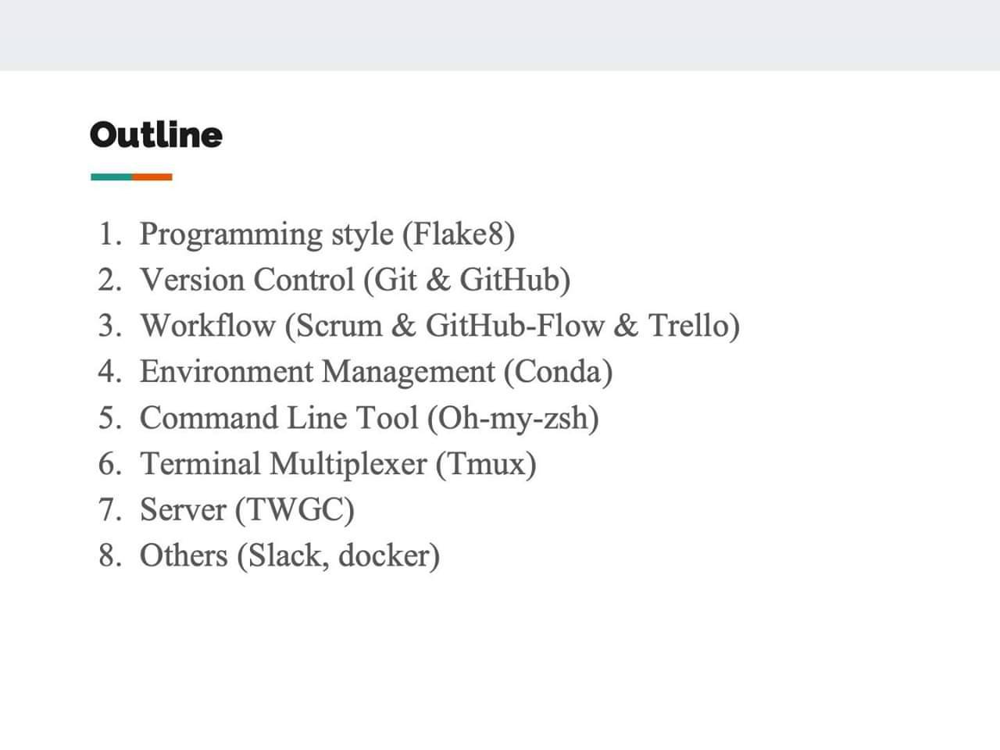

# BS_project_1081
 108-1專題研究
 
## 1st goal ##
_get familiar with GitHub collaboration by working together on a sample program._
- /team1/caesar_encryption/test.py
- /team2/card_game/twentyone.py
- /team3/card_game/card.py
## 專題相關工具 ##

- Flake8, [Python靜態代碼檢查工具Flake8](https://kknews.cc/zh-tw/tech/9yx6mp5.html).
- Git, [Git](https://zlargon.gitbooks.io/git-tutorial/content/).
- Trello, [如何活用 Trello 專案管理？完整技巧案例教學一次學會懶人包](https://www.playpcesor.com/2019/03/trello.html).
- Conda, [用conda建立及管理python虛擬環境](https://medium.com/python4u/用conda建立及管理python虛擬環境-b61fd2a76566).
- Slack, [Slack 完整教學與上手心得：找到正確的團隊溝通之道](https://www.playpcesor.com/2015/06/slack.html).
- Docker, [Docker —— 從入門到實踐](https://philipzheng.gitbooks.io/docker_practice/content/install/centos.html).
